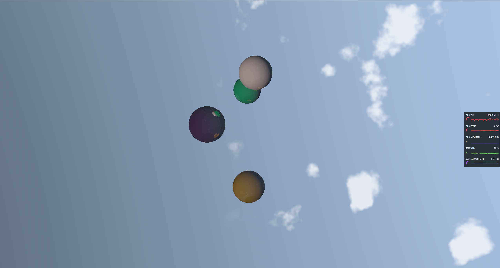

# 3dRenderer

A real-time sphere renderer written in Rust with WGSL shaders, built from scratch without a 3D framework.



### Working demo

<video src="https://github.com/user-attachments/assets/740a0bb0-38ad-4bfd-b3bf-3ea076f899f5" controls style="max-width: 100%;" muted autoplay loop>
</video>

## What it does

Renders shaded spheres with configurable lighting in a window, using `wgpu` for GPU access and hand-written WGSL shaders for the rendering pipeline. No Bevy, no three-rs, no rend3 — the scene setup, camera, lighting, and draw loop are all written directly against the `wgpu` API.

## Why I built it

I wanted to understand modern GPU programming from the layer below a rendering framework. Most tutorials start with a framework and never leave it, which hides the parts I actually wanted to learn: command buffers, bind groups, uniform layout, and how a draw call is actually assembled.

## What's interesting in the code

- **Hand-written WGSL shaders** for per-fragment lighting rather than pulling in a shader library.
- **Direct `wgpu` pipeline setup** — bind group layouts, vertex buffers, and render pass configuration written explicitly.
- **Minimal dependency footprint.** The goal was to understand the stack, not import it.

## What's next

I'm treating this as a base to explore in specific directions rather than a general-purpose engine. Candidate extensions:

- Deferred shading in WGSL
- A point cloud viewer that handles large datasets by streaming to the GPU
- Proper scene graph and material system

If you want to follow along, I write about the work at [profile.algosculptor.com/writings](https://profile.algosculptor.com/writings).

## Running it

Requires a recent Rust toolchain ([rustup.rs](https://rustup.rs)).

```bash
git clone https://github.com/sahuishan01/3dRenderer.git
cd 3dRenderer
cargo run --release
```

For iterative development:

```bash
cargo watch -c -w src -x run
```

## License

MIT
